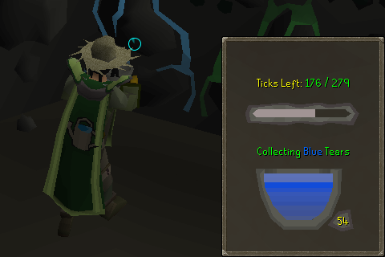
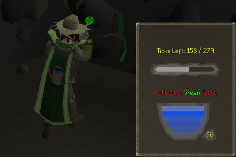
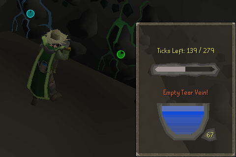

# Improved Tears of Guthix Interface
A simple plugin that improves the Tears of Guthix minigame interface by
adding an explicit tick timer and an indicator of the action you are
currently performing (e.g. Collecting Blue/Green Tears).

## Example of the plugin in action

